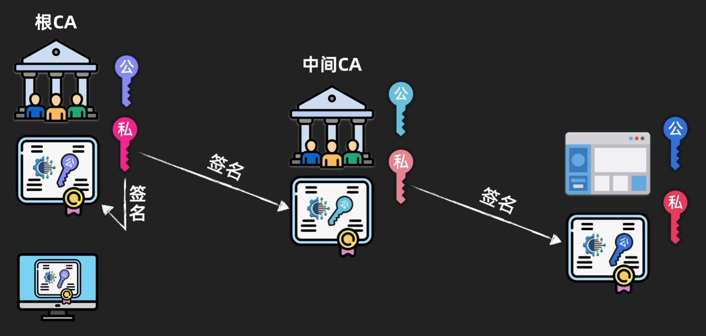

# CFUPS证书套件

## 前言
* 请先自行安装OpenSSL库, 包括include和lib
* 该证书套件版本号跟随主分支版本号
* 该证书套件专为CFUPS使用, 无法应用别的协议

---
## 目录
* [`套件内容`](#套件内容)
  * [`gen-cert`](#gen-cert)
  * [`sign`](#sign)
  * [`verify`](#verify)
* [`证书链`](#证书链)
* [`吊销证书`](#吊销证书)
* [`集成库`](#集成库)

---
## 套件内容
### [gen-cert](gen-cert.c)
用于生成证书公钥以及私钥文件
```
> gen-cert <文件路径> <文本信息> <到期时间>
> gen-cert <文件路径> <文本信息> <到期时间> [CA]
> gen-cert <文件路径> <文本信息> <到期时间> [IP地址]
> gen-cert <文件路径> <文本信息> <到期时间> [CA] [IP地址]
```
其中`<文件路径>`为生成文件路径和文件名  
> gen-cert /path/to/filename ...

执行完成后会生成
* 未签名的公钥证书
  > /path/to/filename.pub
* 私钥文件
  > /path/to/filename

未签名的公钥证书文件格式
```
   0 <-3|4--7|8------> EF
00 |       X25519       |
10 |      pub key       |
20 |      ED25519       |
30 |      pub key       |
40 | st | vt | text msg |
50 |                    |
60 |                   |f
70 |      IP addr       |
```
其细节可以在[gen-cert.c](gen-cert.c)中查看

### [sign](sign.c)
用于CA私钥签名未签名的公钥证书, 生成已签名的的证书文件  
**注意: 私钥文件必须是CA**  
**也就是gen-cert的CA必须为true生成的私钥文件才可以签名**
```
> sign <CA私钥文件> <未签名的公钥证书>
```
例如
> sign /path/to/private_key /path/to/pub_key_cert.pub

执行后生成与未签名的公钥证书同名的.cert证书文件
> /path/to/pub_key_cert.cert

签名实际上就是把签名追加到pub文件末尾, 产生新的文件.cert  
ED25519签名数据一般为64字节
```
   0 <----------> F
00 |              |
...| pub key cert |
70 |              |
-------------------
80 |              |
...|  sign data   |
B0 |              |
```
其细节可以在[sign.c](sign.c)中查看

### [verify](verify.c)
用CA证书对普通证书验签, 检验合法性
```
> verify <CA证书> <普通证书>
```
例如
> verify /path/to/CA.cert /path/to/test.cert

如果验签成功输出OK, 失败输出Fail, 遇到错误会直接打印错误信息  
其细节可以在[verify.c](verify.c)中查看

---
## 证书链

图片来自[`bilibili 技术蛋老师 数字签名和CA数字证书的核心原理和作用`](https://www.bilibili.com/video/BV1mj421d7VE)  
例子:
```shell
# 生成根CA证书, 文本信息"This is a root CA certificate", 有效期30天
./gen-cert root-ca "This is a root CA certificate" 30 true

# 根CA证书进行自签名
./sign root-ca root-ca.pub
rm root-ca.pub # 删除未签名的公钥证书

# 生成中间CA, 文本信息"This is a mid CA certificate", 有效期30天
./gen-cert ca "This is a mid CA certificate" 30 true

# 根CA签名中间CA
./sign root-ca ca.pub
rm ca.pub # 删除未签名的公钥证书

# 生成普通证书, 文本信息"This is a normal certificate", 有效期30天, IP为127.0.0.1
./gen-cert cert "This is a normal certificate" 30 127.0.0.1

# 中间CA签名普通证书
./sign ca cert.pub
rm cert.pub # 删除未签名的公钥证书

# 验签
./verify root-ca.cert root-ca.cert # 根CA自验签
./verify root-ca.cert ca.cert # 根CA对中间CA验签
./verify ca.cert cert.cert # 中间CA对普通证书验签
```

---
## 吊销证书
证书中不包含吊销证书列表  
因此需要自行实现

这里提供一个可行方案:  
```
吊销证书列表服务与应用层检查吊销证书逻辑均自行实现
搭建吊销证书列表网站(建议使用https, 建议使用tls1.3)
当CFUPS建立连接时, 可以先与其连接, 但是不传输任何数据
同时访问吊销证书列表网站, 查看对方证书是否被吊销
如果是立刻断开连接, 如果证书没有被吊销, 方可传输数据
```
以上方式旨在不影响传输性能的同时确保对方证书可靠  
作者不对你们自己实现的逻辑做任何安全保证  
实现逻辑前请先备好网络安全等功课

---
# 集成库
静态链接crypto, 封装了一些接口  
参见[`key`](key)文件夹
