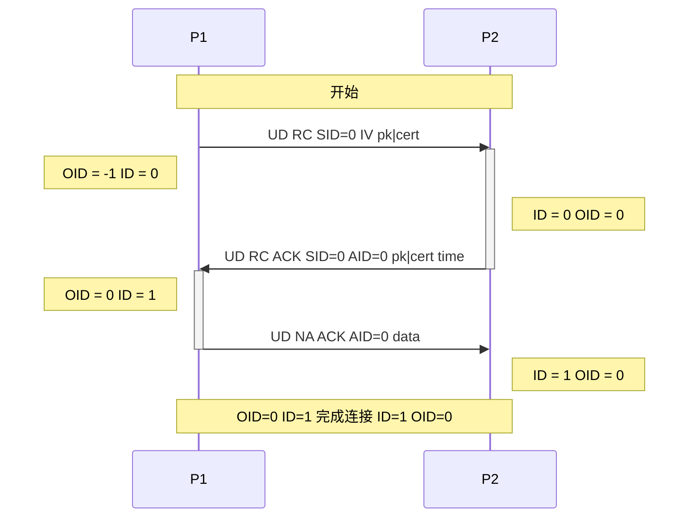
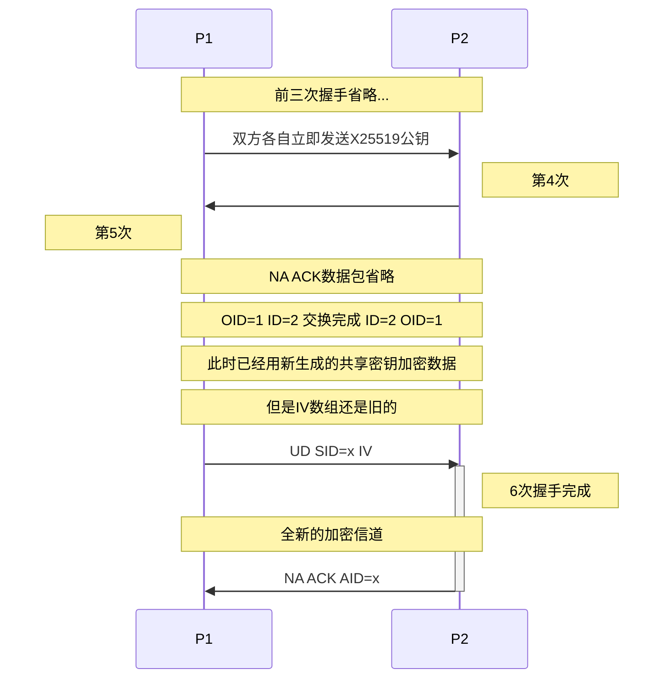

# CFUPS协议
### 版本6
### CSG Framework Universal Protocol Secure
### 安全CSG框架通用协议

## 更新日志
* CCPS更名CFUPS(6)
* 定义`规定时间`, 加入随机数扰乱加密结果(5)
* 加入证书和对端验证, 进行两次密钥交换(4)
* 修改IV传输时间(3)
* SCCL更名CCPS(2)
* 确立SCCL(1)

---

# 目录

* [`协议`](#协议)
  * [`协议表`](#协议表)
  * [`证书`](#证书)
  * [`通信过程`](#通信过程)
    * [`3次握手`](#3次握手)
    * [`6次握手`](#6次握手前3次省略)
  * [`说明`](#说明)

---
# 协议
* [MIT]()
* 阅读本文档前先阅读CFUP协议文档
* 本协议继承于CFUP, 在CFUP原有的基础上增加安全握手过程和数据加密解密过程
* 本协议只关心数据包安全传输, 对于数据内容请自行定义
* 本协议需要自行实现应用层协议管理器和协议对象, 关于实现说明均在下文可查看

## 协议表
<table>
    <tr>
        <td>字节</td>
        <td>0 ~ 31</td>
        <td>32</td>
        <td>33</td>
        <td>34</td>
        <td>35</td>
        <td>36</td>
        <td>37</td>
        <td>38</td>
        <td>...</td>
    </tr>
    <tr>
        <td>S0</td>
        <td>rand</td>
        <td>cf</td>
        <td colspan=2>SID</td>
        <td colspan=5></td>
    </tr>
    <tr>
        <td>S1</td>
        <td>rand</td>
        <td>cf</td>
        <td colspan=2>AID</td>
        <td colspan=5></td>
    </tr>
    <tr>
        <td>S2</td>
        <td>rand</td>
        <td>cf</td>
        <td colspan=2>SID</td>
        <td colspan=2>AID</td>
        <td colspan=3></td>
    </tr>
    <tr>
        <td>S3</td>
        <td>rand</td>
        <td>cf</td>
        <td colspan=6>data</td>
        <td>...</td>
    </tr>
    <tr>
        <td>S4</td>
        <td>rand</td>
        <td>cf</td>
        <td colspan=2>SID</td>
        <td colspan=4>data</td>
        <td>...</td>
    </tr>
    <tr>
        <td>S5</td>
        <td>rand</td>
        <td>cf</td>
        <td colspan=2>SID</td>
        <td colspan=2>AID</td>
        <td colspan=2>data</td>
        <td>...</td>
    </tr>
    <tr>
        <td>S6</td>
        <td>rand</td>
        <td>cf</td>
        <td colspan=2>AID</td>
        <td colspan=4>data</td>
        <td>...</td>
    </tr>
</table>

* 在原有基础上增加S5和S6两种结构体
* 头部加入32个字节的随机数用来扰乱加密后的规律性

## 证书
参见分支`cert`  
使用ED25519进行签名, X25519用于密钥交换

## 通信过程
### 3次握手

### 6次握手(前3次省略)
> 假定P1为连接发起方

## 说明
* 本协议所有整形数据均使用小端序进行dump
* 3次握手过程中, 双方需要互相交换密钥, 也可以发送证书来验证对端
* 如果其中任意一端使用证书, 3次握手需要提升为6次握手, 进行两次密钥交换
* 数据加密使用`AES-256-GCM`加密方式  
  包括cf, SID, AID等字段也要一同加密  
  也就是发送的所有数据都要参与加密
* 第一次握手与第二次握手不需要加密数据  
  从第三次握手开始, 往后的所有传输均需要加密
* pk为pub key, 即公钥, 使用`X25519`密钥交换算法  
  因此pk只需要32个字节传输公钥即可
* 第一次握手中的IV为16个字节的IV数组  
  为`AES-256-GCM`加密使用
* 第三次握手  
  UD NA ACK AID=0 data中的data需要包含32个字节的共享密钥并且加密传输  
  其作用为验证双方的密钥是否相同  
  以防止在握手过程中数据包被修改导致的安全通道无法建立  
  若对方主机发现共享密钥与自己生成的不一致, 需要立刻终止本次通讯
* 任意一端可以在发起连接前选择是否要验证对端  
  如果要验证对端, 那么对端的握手数据必须包含cert  
  否则立刻终止连接
* 关于pk与cert的替换问题, 由于证书的前32个字节正好是X25519公钥  
  所以cert只不过是X25519公钥加上了额外的信息
* 如果任意一端使用cert而非pk(判断数据包长度即可)  
  必须继续交换密钥: [6次握手](#6次握手前3次省略), 仍然使用`X25519`算法  
  如果在`规定时间`内没有继续交换密钥, 立刻终止连接
  `规定时间`为自己定义, 一般为`(重试次数+1)*单次超时时间`  
  在第2次握手时服务端方可以带一个4字节的time以表示`规定时间`, 这个是可选的  
  **最大不超过30s**  
  为了防止双方的重试次数以及单次超时时间不一致  
  注意: 这个密钥必须足够的随机  
  最后一次握手需要发起方(P1)用新共享密钥+旧IV再传一个新的IV给对方
* 在任何握手或者数据传输过程中出现任何错误必须立刻C NA断开连接
