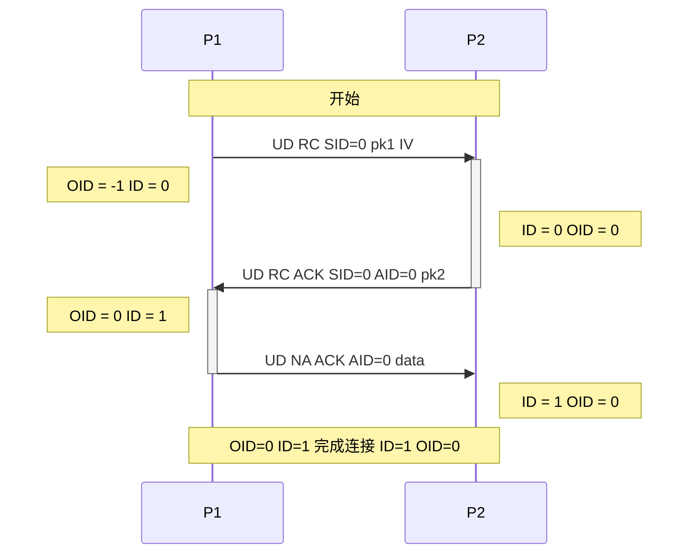

# CCPS协议
### 版本3
### CSG framework host Communication Protocol Secure
### 安全CSG框架主机通信协议

## 更新日志
* 修改IV传输时间(3)
* SCCL更名CCPS(2)
* 确立SCCL(1)

---

# 目录

* [`协议`](#协议)
    * [`协议表`](#协议表)
    * [`通信规则`](#通信规则)
    * [`通信过程`](#通信过程)
        * [`3次握手`](#3次握手)
            * [`说明`](#说明)

---
# 协议
* 未经授权, 严禁将本协议转发他人或公布于众
* 本协议继承于CCP, 在CCP原有的基础上增加安全握手过程和数据加密解密过程
* 本协议只关心数据包安全传输, 对于数据内容请自行定义
* 本协议需要自行实现应用层协议管理器和协议对象, 关于实现说明均在下文可查看

## 协议表
| 字节 | 0 ~ 7 | 8 ~ 11 | 12 ~ 43 | 44 | ... |
| :-: | :-: | :-: | :-: | :-: | :-: |
| 名称 | 无符号校验和 | 有符号校验和 | SHA-256 | cf | ... |

## 通信规则
* 本协议所有整形数据均使用小端序进行dump
* 3次握手过程中, 双方需要互相交换密钥, 使用`X25519`密钥交换算法
* 任何一次数据传输过程中, 必须将数据加密传输, 并且附上指纹以确保数据完整性.  
  其中:
  * 无符号校验和由第8字节开始的所有内容生成
  * 有符号校验和由第12字节开始的所有内容生成
  * SHA-256由第44字节开始的所有内容生成
  * 数据加密使用`AES-256-GCM`加密方式, 加密从第12字节开始的数据  
    无符号校验和与有符号检验和无需加密

## 通信过程
### 3次握手

#### 说明
* 第一次握手与第二次握手不需要加密数据  
  从第三次握手开始, 往后的所有传输均需要加密
* pk1与pk2为pub key, 即公钥, 使用`X25519`密钥交换算法  
  因此pk1与pk2只需要32个字节传输公钥即可
* 第一次握手中的IV为16个字节的IV数组  
  为`AES-256-GCM`加密使用
* UD NA ACK AID=0 data中的data需要包含32个字节的共享密钥并且加密传输  
  其作用为验证双方的密钥是否相同  
  以防止在握手过程中数据包被修改导致的安全通道无法建立  
  若对方主机发现共享密钥与自己生成的不一致, 需要立刻终止本次通讯
